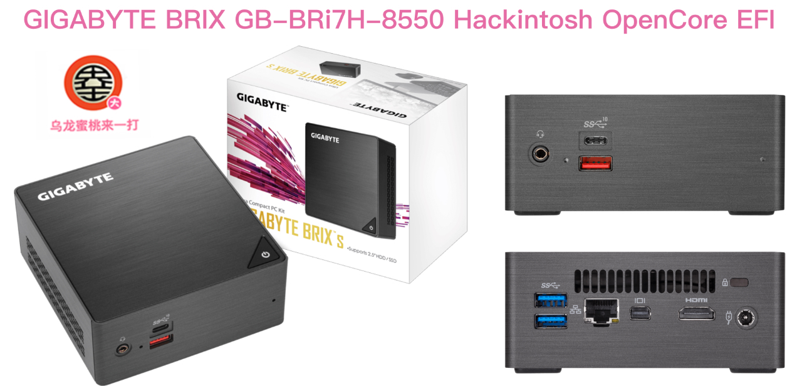

## MAG B760M BOMBER WIFI 黑苹果 OpenCore EFI



### [ENGLISH](README.EN.md)

### [OpenCore 0.9.4](https://github.com/acidanthera/OpenCorePkg)


### macOS

- Ventura
- Monterey


### 硬件

- 芯片组: 待查看
- BIOS版本: F5  2019-03-11
- 处理器: 英特尔 8代 i7-8550U
- 内存:  金士顿 8GB DDR4 2400Mhz + 三星 8G DDR4 2400Mhz
- 硬    盘: 技嘉 GP-GSTFS31240GNTD 240G Windows + MacOS
- 核显: 英特尔超核心显卡 620
- 声卡: 瑞昱 ALC897
- 有线网卡: 英特尔 I219V
- 无    线: 英特尔 Dual Band Wireless-AC 3168
- 电    源:  全汉


### BIOS设置

```
待更新
Settings
  |-- Security
     |-- Secure Boot
       |-- Secure Boot: Disabled

```

### 注意事项

 - 安装成功后必须使用 [OpenCore Configurator](https://mackie100projects.altervista.org/opencore-configurator/) 或者 [OCAuxiliaryTools](https://github.com/ic005k/OCAuxiliaryTools) 生成你自己的 SMBIOS


### 常用工具

- [Hackintool](https://github.com/headkaze/Hackintool) 
- [OCAuxiliaryTools](https://github.com/ic005k/OCAuxiliaryTools) AKA `OCAT`.
- [OpenCore Configurator](https://mackie100projects.altervista.org/opencore-configurator/) AKA `OCC`.
- [gibMacOS](https://github.com/corpnewt/gibMacOS) Build your own MacOS image.
- [ProperTree](https://github.com/corpnewt/ProperTree) Plist editor.


### 联系我们

QQ群: 23304408


